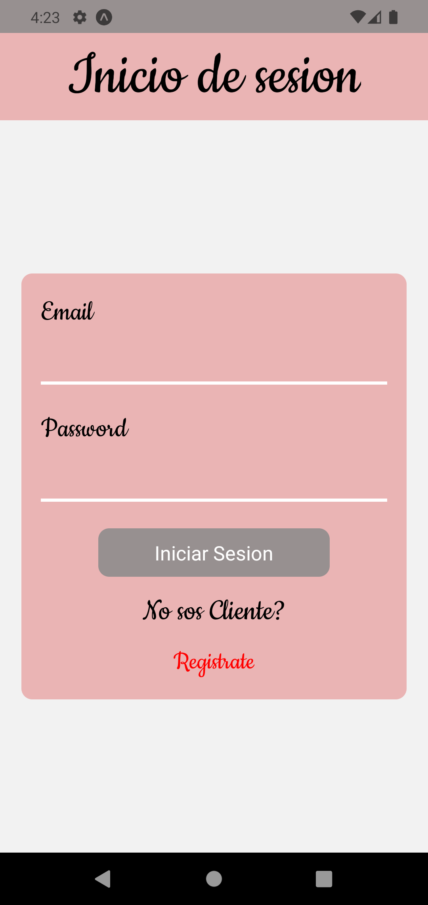
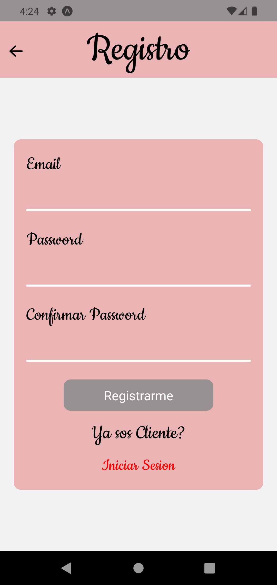
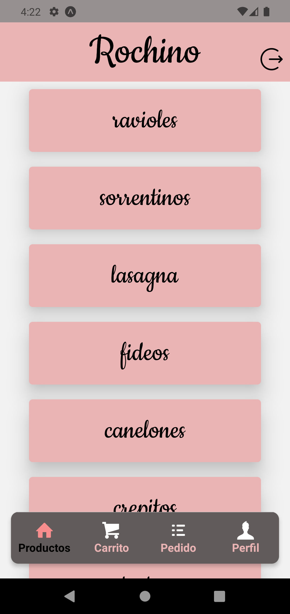
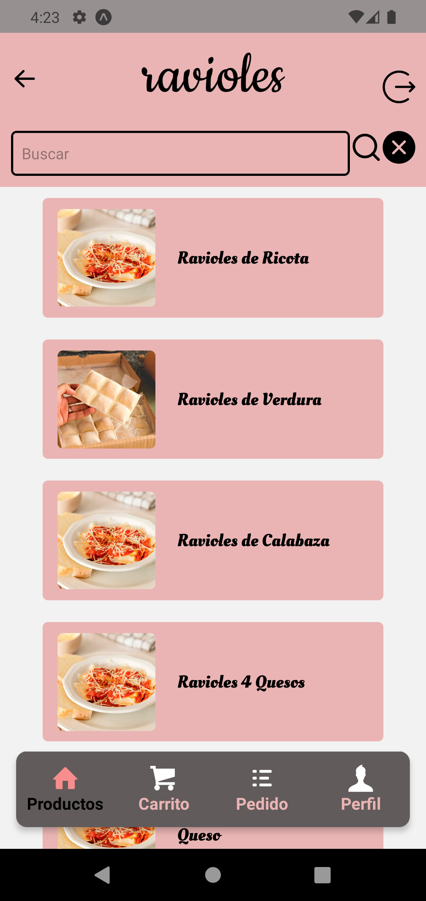
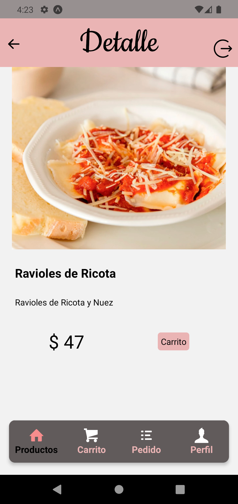
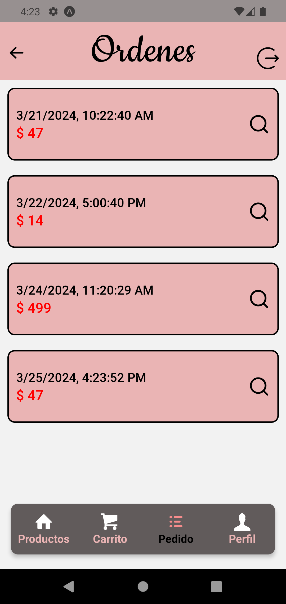

# Rochino - E-Commerce app - React Native

Rochino es una aplicacion mobile para la comercializacion de pastas y pizzas congeladas pre-cocidas, fue creada por medio de React-Native y Expo para un mejor rendimiento tanto en Android como IOS.

## Funcionalidades Principales

- **Acceso Seguro:  Solo los usuarios autenticados pueden acceder a la pantalla del perfil y realizar compras.**
- **Info del usuario:** Muestra detalles del usuario,  nombre completo y direccion.

- 

### Autenticacion con Firebase

* Utiliza el sistema de autenticación de Firebase para gestionar el acceso de usuarios.
* Permite a los usuarios iniciar sesión y registrarse de manera segura.

### Pantalla de Categorias

* Muestra una selección de categorías en tarjetas.
* Al hacer clic en una categoría, se navega a la pantalla de productos correspondiente.

### Pantalla de Productos

* Lista todos los productos en tarjetas con nombre y foto.
* Incluye un buscador para filtrar productos por nombre.
* Al hacer clic en un producto, se navega a la pantalla de detalles del producto.

### Pantalla de Detalles del Producto

* Proporciona una descripción detallada del producto.
* Muestra el precio .
* Permite agregar el producto al carrito.

### Pantalla de Carrito

* Lista el/los productos seleccionados.
* Incluye el valor  de la orden y la cantidad de cada producto seleccionado (tambien incluye la posibilidad de eliminar lo seleccionado del carrito).
* Lista el total del pedido y su confirmacion.

### Pantalla de Ordenes

* Lista todas las ordenes realizadas con su fecha y hora correspondiente.
* Incluye el valor total de la orden.

### Tecnologias Utilizadas

* **Firebase Authentication:** Implementa el sistema de autenticación de Firebase para gestionar la seguridad de la aplicación.
* **React Native Navigation Stack:** Gestiona la navegación entre pantallas.
* **React Native Navigation Buttom tap:** Gestiona la navegación entre pestañas
* **Expo-Picker-Image:** Facilita la carga de imágenes de perfil.
* **Redux:** Centraliza y gestiona el estado de la aplicación.
* **RTK Query y Firebase:** Realiza operaciones de lectura/escritura en la base de datos.

### Instalación

1. Clona el repositorio ***git clone*** [`https://github.com/BlondaKill/lmwebapp.git`](`https://github.com/BlondaKill/lmwebapp.git`)
2. Instala las dependencias: **`npm install `**
3. Configura las claves de API para servicios externos (Expo-Location, Firebase, etc.)
4. Configura las credenciales de Firebase en tu proyecto
5. Ejecuta la aplicacion:  **`npm start`**

### Contacto

* Para preguntas o soporte, contacta a [ma.lauramorales@gmail.com](mailto:Francobertone10@gmail.com)
